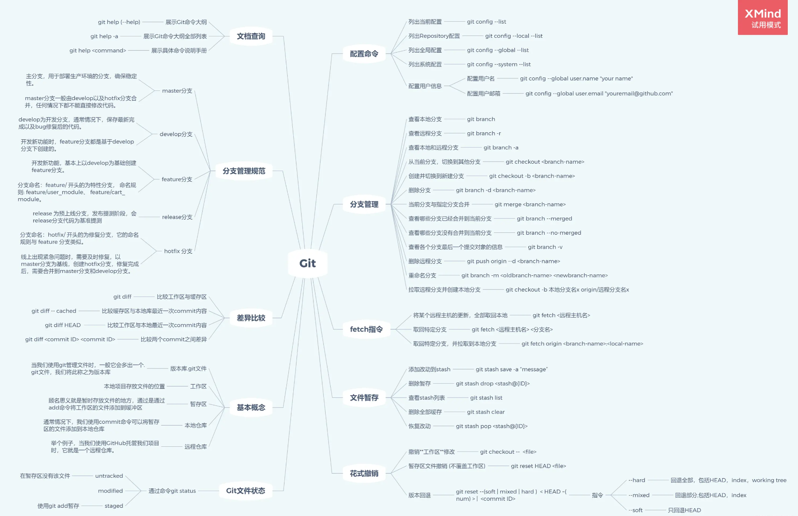

# Git常用命令



## git 配置命令

### 列出配置
```js
git config --config  // 当前配置

git config --local --config // 当前仓库配置

git config --global --config  // 全局配置
```

### 配置用户名及邮箱
```js
git config --global user.name 'your name'

git config --global user.email 'your email'
```

## 分支管理

### 查看分支
```js
git branch  // 查看本地分支

git branch -r  // 查看远程分支

git branch -a  // 查看本地和远程分支
```

### 切换分支
```js
git checkout <branch-name>  // 切换到指定分支

git checkout -b <branch-name>  // 创建分支并切换到该分支

git checkout -b 本地分支名 origin/远程分支名  // 从远程指定分支拉取并创建本地分支
```

### 删除分支
```js
git branch -d <branch-name>  // 删除指定分支

git branch -D <branch-name>  // 强制删除指定分支

git push origin  -d <branch-name> // 删除远程指定分支
```

### 合并分支
```js
git merge <branch-name>
```

### 推送分支
```js
git push

git push -f  // 强制推送，会覆盖远程代码，慎用
```

## tag 管理

### tag 列表
```js
git tag
```

### 创建 tag
```js
git tag <tag-name>
```

### 删除本地 tag
```js
git tag -d <tag-name>
```

### 删除远程 tag
```js
git push origin :refs/tags/<branch-name>
```

## 版本回退
:::tip 注意
版本回退用两种方式 `git reset` 和 `git revert`，但是有些区别：\
`git reset` 通常用来将代码回退到指定版本，该版本之后的提交会全部删除\
`git revert` 通常用于需要对某个版本进行修改，其他的版本不受影响，提交后会产生一个新的版本
:::
### git reset
```js
git log  // 查看提交历史，确认需要回退的版本

git reset --soft <log-id>   // 回退到某个版本，回退的修改会保存在工作区

git reset --hard <log-id>  // 回退到某个版本，回退的修改会消失

git reset --hard HEAD^   // 回退到上一个版本，HEAD^^就是上上个版本，以此类推
```

### git revert
```js
git revert -n <log-id>
```


